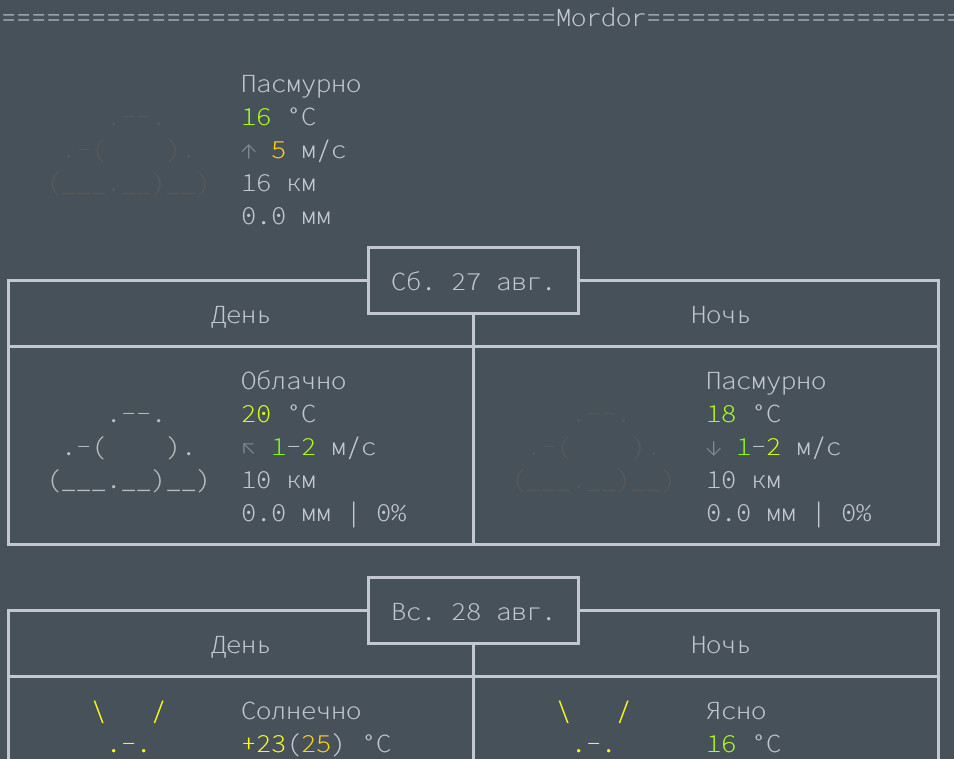

Скрипт показывает погоду в терминале используя сервис [wttr.in](https://wttr.in).


### Install

```
git clone https://github.com/RNDpacman/weather_console.git
```

```
python -m venv ./weather_console
```

```
cd ./weather_console
```

```
source ./bin/activate
```

```
pip install --upgrade pip
```

```
pip install -r requirements.txt
```

### Help

```
python ./main.py --help
```
```
usage: main.py [-h] [--options OPTIONS] [--lang LANG] locations [locations ...]

Show weather from https://wttr.in

positional arguments:
  locations          locations one or more

options:
  -h, --help         show this help message and exit
  --options OPTIONS  See https://wttr.in/:help. Default: "nM"
  --lang LANG        Language. See https://wttr.in/:help. Default: "ru"
```

### Run

```
python ./main.py Москва Мордор Владивосток 
```



